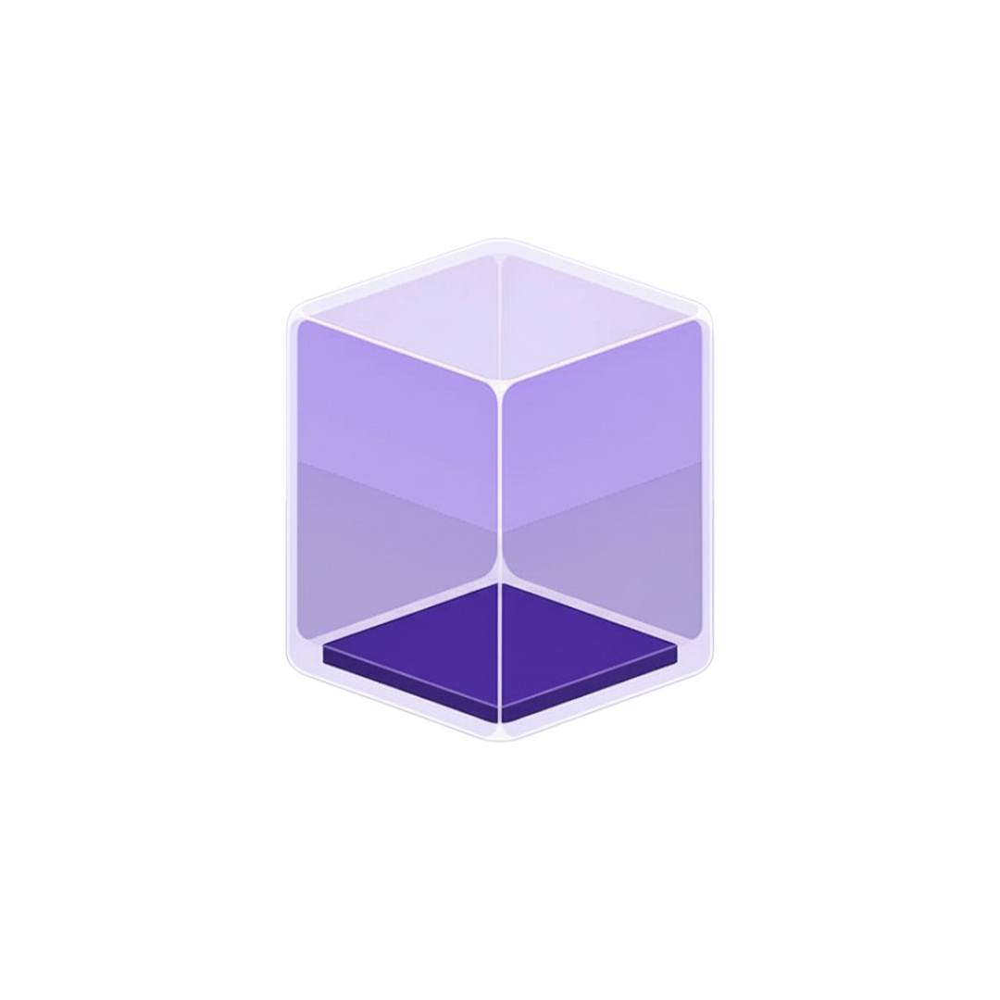

<div align="center">
  

# Container Kit

**A modern desktop application for Apple container management**

[](https://opensource.org/licenses/MIT)
[](https://tauri.app)
[](https://svelte.dev)
[](https://www.typescriptlang.org)

_Built with Tauri, Svelte 5, Typescript • Features beautiful native interface for managing macOS containers, sandboxes, and virtualization_

[Features](#-features) • [Installation](#-installation) • [Usage](#-usage) • [Development](#-development) • [CLI Tools](#-cli-tools)

</div>

---

## 🚀 Overview

Container Kit is a comprehensive desktop application designed specifically for Apple ecosystem container management. It provides a beautiful, native interface for managing macOS app containers, sandboxes, virtualization environments, and more, all while maintaining the highest standards of security and performance that Apple users expect.

### 🎯 Key Highlights

- **🍎 Apple-First Design** - Built specifically for macOS with native Apple HIG compliance
- **⚡ Modern Architecture** - Tauri + Svelte 5 + Typescript developer experience
- **🛡️ Security Focused** - Comprehensive sandbox and container security management
- **🎨 Beautiful Interface** - Multiple theming options with dark/light modes and smooth animations
- **🔧 Developer Friendly** - Extensive CLI tooling and migration system for development

## ✨ Features

### 🏗️ Container Management

- **App Sandbox Containers** - Manage sandboxed macOS application environments
- **System Containers** - Handle isolated service environments and system processes
- **Virtualization Containers** - Full integration with Apple's container CLI

### 🌐 Network & Infrastructure

- **Container Networking** - Advanced networking configuration for Apple virtualization
- **DNS Management** - Container-specific DNS settings and resolution
- **Registry Management** - Apple container configuration and policy management

### 🎨 User Experience

- **ShadCN Interface** - Follows ShadCN Interface Guidelines
- **Dark/Light Themes** - Automatic theme switching with system preferences
- **Smooth Animations** - Powered by Motion library for fluid interactions
- **Data Visualization** - Beautiful charts and graphs with LayerChart
- **Responsive Design** - Optimized for various screen sizes and resolutions

### 🛠️ Developer Tools

- **TypeScript Scripts** - Comprehensive build and automation scripts
- **Migration System** - Robust database schema management with version control
- **Build Pipeline** - Custom Tauri build system with Apple code signing
- **Type Safety** - Full TypeScript integration throughout the stack

## 📸 Screenshots

### Main Dashboard

_Beautiful overview of your container ecosystem_


### Container Management

_Intuitive container lifecycle management_


### Development Scripts

_Powerful TypeScript automation and build scripts_


### Settings & Configuration

_Comprehensive configuration options_


## 🚀 Installation

### Prerequisites

- **macOS 26.0+** (Apple Silicon required)
- **Apple Silicon Mac** (M1/M2/M3/M4)
- **Xcode Command Line Tools**

```bash
xcode-select --install
```

- **Apple Container CLI** (if using container features)

```bash
brew install --cask container
```

## 🔧 Development Environment

For detailed IDE setup, development workflow, and code standards, see our [Contributing Guide](CONTRIBUTING.md).

**Quick Setup:**

- **Recommended**: [Zed](https://zed.dev/) with Svelte, Rust, and TypeScript extensions
- **Alternative**: VS Code with Svelte, Tauri, and rust-analyzer extensions

### Download

#### Option 1: Direct Download (Recommended)

1. Download the latest `.dmg` from [Releases](https://github.com/your-username/container-kit/releases)
2. Open the downloaded `.dmg` file
3. Drag Container Kit to your Applications folder
4. Launch from Applications or Spotlight

#### Option 2: Build from Source

```bash
# Clone the repository
git clone https://github.com/etherCorps/containerKit.git
cd containerKit

# Install dependencies (requires pnpm)
npm install -g pnpm
pnpm install

# Build the application
pnpm release
```

### First Launch

1. **Grant Permissions** - Container Kit requires system permissions for container management
2. **Code Signing** - The app is signed and notarized for security
3. **Initial Setup** - Follow the welcome wizard to configure your environment

## 📖 Usage

### Getting Started

1. **Launch Container Kit** from Applications or Spotlight
2. **Dashboard** - Overview of your containers
3. **Create Containers** - Use the container tab to create new Containers from images
4. **Manage Existing** - View and manage containers in the Containers tab

### Core Workflows

[//]: # '#### Creating a New Container'
[//]: #
[//]: # '1. Navigate to **Builder** → **New Container**'
[//]: # '2. Select container type (App Sandbox, System, Virtualization, etc.)'
[//]: # '3. Configure resources and security policies'
[//]: # '4. Review settings and create'
[//]: # '#### Managing Existing Containers'
[//]: #
[//]: # '1. Go to **Containers** tab'
[//]: # '2. View running, stopped, and configured containers'
[//]: # '3. Use context menus for start/stop/configure operations'
[//]: # '4. Monitor resource usage and logs'
[//]: #
[//]: # '#### Network Configuration'
[//]: #
[//]: # '1. Access **Network** section'
[//]: # '2. Configure container networking and DNS'
[//]: # '3. Set up port forwarding and security rules'
[//]: # '4. Monitor network activity'
[//]: #
[//]: # '#### Registry Management'
[//]: #
[//]: # '1. Open **Registry** tab'
[//]: # '2. Manage container images and configurations'
[//]: # '3. Import/export container policies'
[//]: # '4. Version control for container definitions'

### Advanced Features

#### Script Integration

```bash
# Build Tauri application
pnpm build:tauri

# Complete release workflow
pnpm release

# Migration management
pnpm db:migrations

# Development workflow
pnpm dev
```

#### Database Management

```bash
# Generate SQL migrations from schema
pnpm db:generate

# Generate Rust migration bindings
pnpm db:migrations
```

## 🏗️ Development

### Tech Stack

- **Frontend**: Svelte 5, SvelteKit, TypeScript, TailwindCSS
- **Backend**: Tauri 2.x, Rust, LibSQL, Drizzle ORM
- **Build**: TypeScript automation scripts, pnpm, Vite

### Quick Start

```bash
# Install dependencies
npm install -g pnpm
pnpm install

# Start development server
pnpm dev

# Build application
pnpm build:tauri
```

For detailed setup, architecture, project structure, and development workflows, see our [Contributing Guide](CONTRIBUTING.md).

## 🤖 AI/LLM Integration

This project includes comprehensive AI/LLM context files:

- **`llm.txt`** - Main project context and architecture

These files help AI assistants understand the project structure and provide better development assistance.

## 📋 Scripts Reference

### Core Development Commands

```bash
pnpm dev           # Development server with hot reload
pnpm build         # Production frontend build
pnpm preview       # Preview production build
pnpm tauri         # Tauri CLI commands
```

### Build and Release Commands

```bash
pnpm build:tauri           # Build Tauri application
pnpm release               # Complete build and release workflow
pnpm copy:build-files      # Copy build artifacts to release structure
```

### Database Management

```bash
pnpm db:generate           # Generate SQL migrations from schema, also runs db:migrations
pnpm db:migrations         # Generate Rust migration bindings
```

### Development Utilities

For detailed documentation on all available scripts, see [scripts/docs/README.md](./scripts/docs/README.md)

## 🤝 Contributing

We welcome contributions! Whether you're fixing bugs, adding features, improving documentation, or enhancing the developer experience, your contributions help make Container Kit better for everyone.

Please see our [Contributing Guide](CONTRIBUTING.md) for detailed information on:

- 🏗️ **Development Setup** - Getting your environment ready
- 📏 **Code Standards** - TypeScript, Svelte, and Rust conventions
- 🧪 **Testing Guidelines** - How to test your changes
- 🚀 **Build Process** - Development and release workflows
- 📝 **Documentation** - Writing and updating docs
- 🐛 **Bug Reports** - How to report issues effectively
- 💡 **Feature Requests** - Proposing new functionality

**Quick Start**: Fork → Clone → `pnpm install` → `pnpm dev` → Make changes → Submit PR

## 🙏 Acknowledgments

- **Apple** - For the excellent container and developer tools
- **Tauri Team** - For the amazing desktop application framework
- **Svelte Team** - For the revolutionary frontend framework
- **Open Source Community** - For the incredible ecosystem of tools and libraries

## 📞 Support

- 📖 **Documentation** - Check our [Wiki](https://github.com/your-username/container-kit/wiki)
- 🐛 **Bug Reports** - [GitHub Issues](https://github.com/etherCorps/ContainerKit/issues?q=sort%3Aupdated-desc+is%3Aissue+is%3Aopen)
- 💬 **Discussions** - [GitHub Discussions](https://github.com/etherCorps/ContainerKit/discussions)
- 📧 **Email** - [shivam@ethercorps.io](mailto:shivam@ethercorps.io)

---

<div align="center">

**Built with ❤️ for the Apple ecosystem**

[⭐ Star this project](https://github.com/etherCorps/ContainerKit) • [🐦 Follow updates](https://twitter.com/theether0) • [💻 Contribute](CONTRIBUTING.md)

</div>
